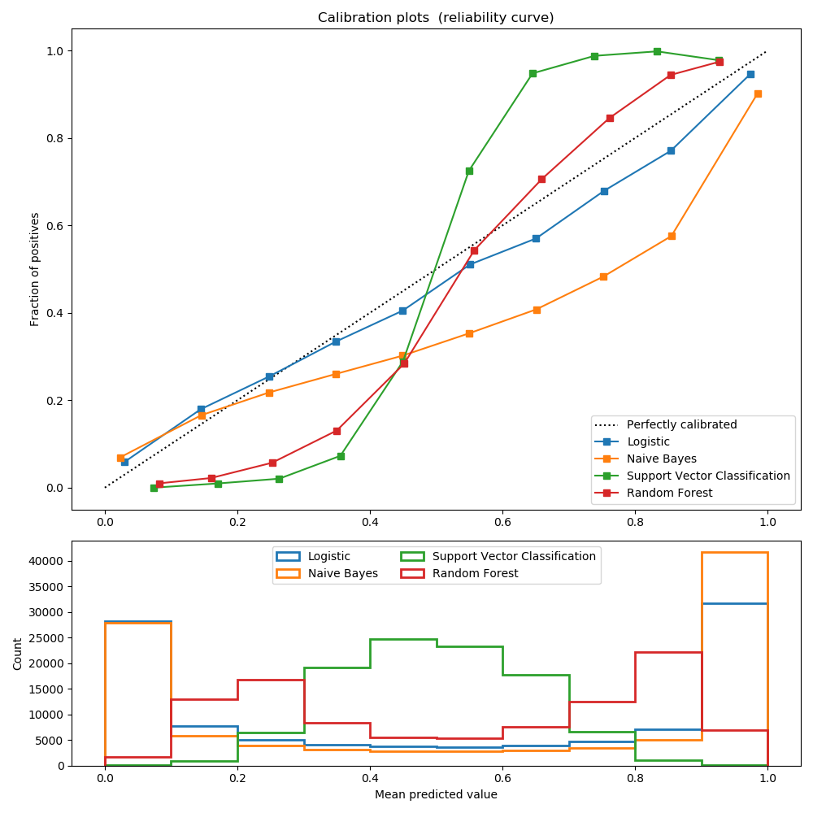
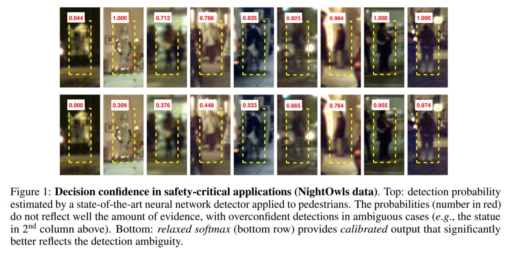

Instead of predicting class values directly for a classification problem, it can be convenient to predict the probability of an observation belonging to each possible class.

Predicting probabilities allows some flexibility including deciding how to interpret the probabilities, presenting predictions with uncertainty, and providing more nuanced ways to evaluate the skill of the model.

Predicted probabilities that match the expected distribution of probabilities for each class are referred to as calibrated. 

* Reliability Diagrams (Calibration Curvs)
A reliability diagram is a line plot of the relative frequency of what was observed (y-axis) versus the predicted probability frequency  (x-axis).

The position of the peoints or the curve relative to the diagonal can help to interpret the probabilities; for example:

  * Below the diagonal: The model has over-forecast; the probabilities are too large.
  * Above the diagonal: The model has under-forecast; the probabilities are too small.

* importatnt 
  * Some algorithms are fit in such a way that their predicted probabilities are already calibrated. Without going into details why, logistic regression is one such example.

  *  Other algorithms do not directly produce predictions of probabilities, and instead a prediction of probabilities must be approximated. Some examples include neural networks, support vector machines, and decision trees.

Calibration of prediction probabilities is a rescaling operation that is applied after the predictions have been made by a predictive model.

There are two popular approaches to calibrating probabilities; they are the Platt Scaling and Isotonic Regression.

[here](https://machinelearningmastery.com/calibrated-classification-model-in-scikit-learn/)

There are two methods of Calibration:
* Sigmoid/ Platt’s

$$P_i=\frac{1}{1+exp^{Af_i+B}}$$

$$f_i=f(\bold{x_i})$$ is the output of model given $$\bold{x_i}$$. A and B are parameters that will be learned.
$$P_i$$ is the probabilty of the datapoint belonging to a class.

* Isotonic 

$$y_i=m(f_i)+\epsilon_i$$

$$\hat{m}=argmin_z(y_i-z(f_i))$$

scikit-learn: 
* calibration_curve()
*  CalibratedClassifierCV

[Code :] ( https://github.com/SubhamIO/Calibration-Techniques-in-Machine-Learning)

[Relaxed Softmax: Efficient Confidence Auto-Calibration for Safe Pedestrian Detection](http://www.robots.ox.ac.uk/~vedaldi/assets/pubs/neumann18relaxed.pdf)

[Confidence Calibration and Predictive Uncertainty Estimation for Deep Medical Image Segmentation](https://arxiv.org/pdf/1911.13273.pdf)

