* Note: This page is a mixed up of different references. Networks and algorithms and some texts are taken from the references.

The deep neural networks trained on
training datasets (source domain) cannot generalize well on the application datasets (target domain) because there is a discrepancy between assumptions on the source domain and the target domain. For example, in medical imaging data may be collected in different medical centers, the radiolosoists may use different machine settings or their behaviour sometimes may affect the data characterization. Essentially, the difference in data distribution between domains makes it difficult
to transfer knowledge from the source to target domains. This transferring problem is known as domain shift (Torralba
and Efros 2011).[11]
Domain adaptation tackles the domain shift problem concerning two different datasets. Specifically 
Unsupervised domain adaptation (UDA) concerns
the domain shift problem while transferring the model
from a labeled source domain to an unlabeled target domain.[11]
The common idea of UDA is to make to transfer the both datasets ot a feature space which has the same information for both domains (long et al. 2015;
Ganin et al. 2016). 

22
applications such as natural language processing [12, 27] and computer vision [24, 65, 67].

Instead of decreasing the distance betweem the two domains in training and testing time, we can use their moments.
Moment-based algorithms perform particularly well in many practical tasks [21, 4, 53, 65,
67, 66, 30, 34, 68, 42, 45, 28, 63, 64, 46, 44].

similarity measure:
Wasserstein distance [15], the Maximum Mean Discrepancy [37] or the f-divergences [69]
Appropriate distance function for domain adaptation [8, 15, 36, 37, 69, 24]

11
Previous works in domain adaptation are majorly based on two techniques: 

* domain-adversarial learning
In particular, the domain-adversarial
learning methods (Ganin et al. 2016; Tzeng et al. 2017)
train a domain discriminator to distinguish whether the feature is from the source domain or target domain. To fool
the discriminator, the feature generator has to output similar source and target feature distributions. However, it is
challenging for this type of UDA methods to learn discriminative features on the target domain (Saito et al. 2018;
Xie et al. 2018). That is because they overlook whether the
aligned target features can be discriminated by the classifier.
it aligns feature distributions between domains but does not consider whether the
target features are discriminative.
domain-adversarial
learning cannot match the multi-modal distributions due to practical issues,
e.g., mode collapse (Che et al. 2017)

* self-training.
self training - > psuedo label -> . However, the alignment between the source and target feature
distributions is implicit and has no theoretical guarantee.
With unmatched target features, self-training based methods
can lead to a drop of performance in the case of shallow networks (Zou et al. 2018; Saito et al. 2019).

It utilizes the model predictions to enhance the discrimination of target features, but it is unable to explicitly
align domain distributions.
Recently, many works apply the above self-training based
methods to unsupervised domain adaptation (Zou et al.
2018; Chen, Xue, and Cai 2019; French, Mackiewicz, and
Fisher 2018). These UDA methods implicitly encourage the
class-wise feature alignment between domains and achieve
surprisingly good results on multiple UDA tasks.

33
The performance of computer vision models has been
improved significantly by deep neural networks that take
advantage of large quantities of labeled data. However,
the models trained on one dataset typically perform
poorly on another different but related dataset [1], [2].

Existing UDA algorithms attempt to mitigate domain shifts by only considering the classifier-induced discrepancy between the two
domains, which can reduce the domain divergence [3].

 Advances in adversarial DA
can always be found in recently reported works. Long
et al. propose to measure the domain divergence by
considering the distribution correlations for each class of
objects [16], [17], [18]. Domain separation network [6] is
also proposed to better preserve the component that is
private to each domain before aligning the latent feature
distributions.

## [Side tunning](https://arxiv.org/pdf/1912.13503.pdf)

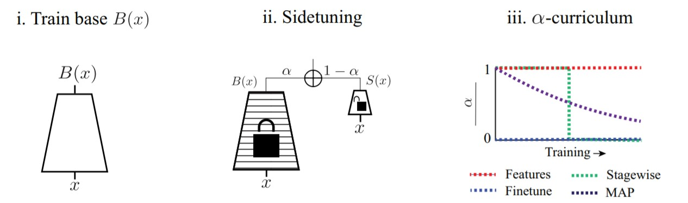

## [Adversarial-Learned Loss for Domain Adaptation (ALDA)](https://arxiv.org/pdf/2001.01046.pdf)
Note: Most of the text here have been copied from [here](https://arxiv.org/pdf/2001.01046.pdf).

* Idea: integrate domain-adversarial
learning and self-training method.

To achieve this goal, we first analyze
the loss function of self-training with pseudo-labels (Zou et
al. 2018) on the unlabeled target domain. Previous works
in learning from noisy labels (Sukhbaatar and Fergus 2014;
Zhang and Sabuncu 2018) proposed accounting for noisy
labels with a confusion matrix. Following their analyzing
approach, we reveal that the loss function using pseudolabels (Zou et al. 2018) differs from the loss function learned
with the ground truth by a confusion matrix.

## [Learning Bounds for Moment-Based Domain Adaptation](https://arxiv.org/pdf/2002.08260.pdf)
Note: Most of the text here have been copied from [here](https://arxiv.org/pdf/2002.08260.pdf).

* Question: which further conditions can we expect a discriminative model to perform
well on a future test sample given that only finitely many moments are aligned with those of a prior training sample

Ben-David et al. [8, 11, 7, 9] propose bounds on the misclassification
probability of discriminative models for domain adaptation. 

## [discriminative feature alignment (DFA)](https://arxiv.org/pdf/2006.12770.pdf)
Note: Most of the text here have been copied from [here](https://arxiv.org/pdf/2006.12770.pdf).
[Code:](https://github.com/JingWang18/Discriminative-Feature-Alignment)

* idea

  * construct a common feature space under the guidance of the Gaussian prior.

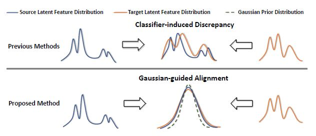

  * instead of the discriminator error, it minimizes the direct L1-distance between the decoded samples.

$$L_1(\bold{x}_s,\hat{\bold{x}}_t) \propto -\log_p(\bold{x}_s | \bold{z}_t)$$

* Distribution alignment

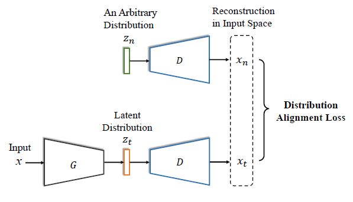

* Network

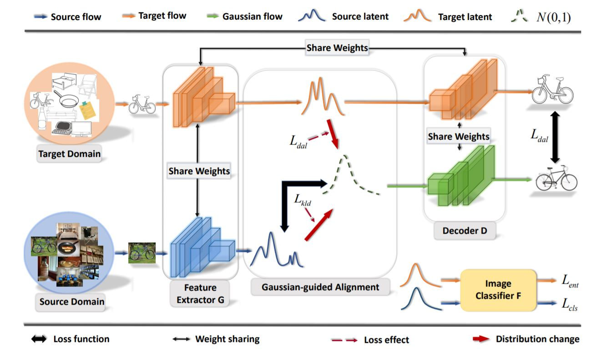

* Algorithm

  * Adversarial Domain Adaptation

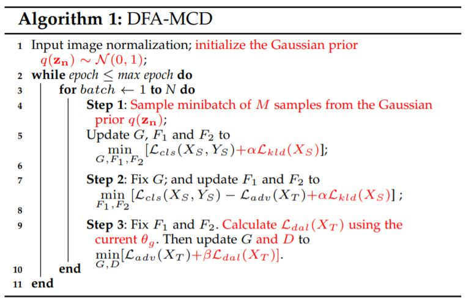

  * Non-adversarial Domain Adaptation

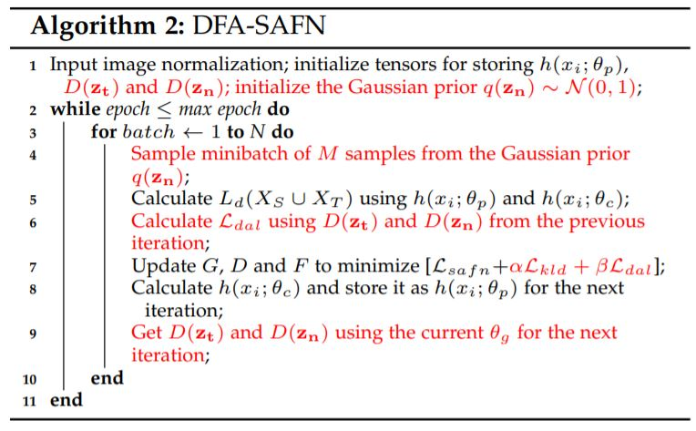

* Decoder 

The proposed regularization has two functionalities in
our model: 1) distribution alignment; 2) discriminative
feature extraction. The distribution alignment mechanism
alone cannot guarantee the produced latent distribution
p(zt) is adequately discriminative for F to generalize well
to the target domain. To further enforce G to focus on the
cross-domain classification discriminative characteristics
of the target samples, we let the weight matrices of G
and D be symmetric. The choice of weight tying for the
proposed encoder-decoder is motivated by the denoising
autoencoder (DAE) [26]. DAE shows that the tying weight
makes it more difficult for an encoder to stay in the linear
regime of its nonlinearity.

## [Maximum Classifier Discrepancy for Unsupervised Domain Adaptation](https://arxiv.org/pdf/1712.02560.pdf)
* Idea: to align source and target features by utilizing the task-specific classifiers as a discriminator in order to consider the relationship between class
boundaries and target samples.

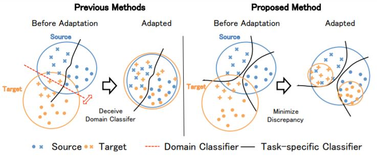

* Network and algorithm

  * Step A: train both classifiers and generator to
classify the source samples correctly. In order to make classifiers and generator obtain task-specific discriminative features, this step is crucial. We train the networks to minimize
softmax cross entropy. The objective is as follows:

$$ min_{G,F1,F2}L(\bold{X}_s, \bold{Y}_s)$$

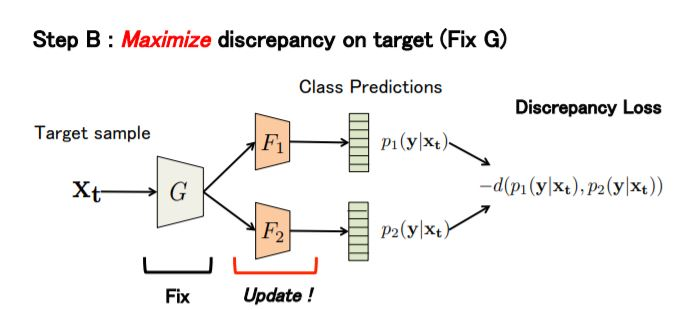

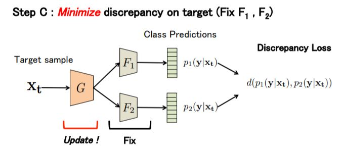

## [Learning to Learn Single Domain Generalization](https://arxiv.org/pdf/2003.13216.pdf)
* idea: adversarial domain augmentation to solve this Outof-Distribution (OOD) generalization problem -> cast the model
training in a meta-learning scheme and use a Wasserstein
Auto-Encoder (WAE) to relax the widely used worst-case
constraint

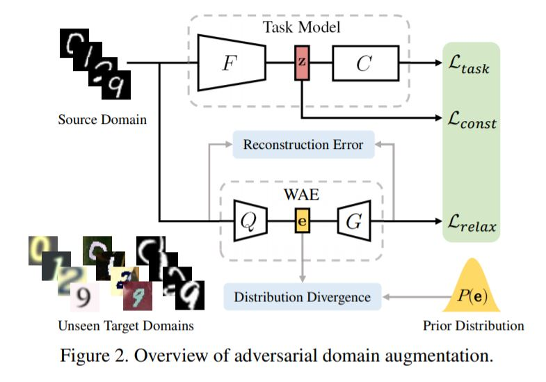

$$L_{ADA}=L_{task}(\theta;\bold{x})-\alpha L_{const}(\theta;\bold{z})+ \beta L_{relax}(\si;\bold{x})$$

$$L_{task}(y,\hat{y})=- \sum_i y_i log\hat{y}_i$$

$$L_{const}=\frac{1}{2}\|z-z^+\|_2^2 +\infty. \textbf{1}{y \neq y^+}$$

WAE, training
$$\min_\si [\|G(Q(\bold{x})) − x\|^2 + \lambda D_e(Q(\bold{x}), P(\bold{e}))]$$
$$D_e$$: could be Maximum Mean Discrepancy (MMD) or GANs

$$L_{relax}=\| x^+ - V(x^+) \|^2$$

ghg

## Semi-supervised Domain Adaptation via Minimax Entropy
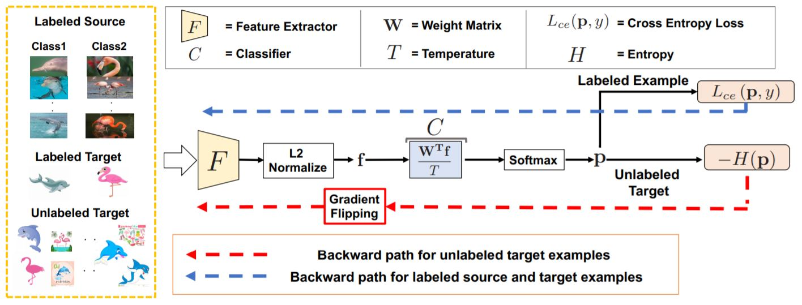

## [Unified Deep Supervised Domain Adaptation and Generalization](http://vision.csee.wvu.edu/publications/motiianPAD17iccv.pdf)

## [Unsupervised domain adaptation formedical imaging segmentation with self-ensembling](https://www.researchgate.net/publication/328997307_Unsupervised_domain_adaptation_for_medical_imaging_segmentation_with_self-ensembling)

# [Domain adaptation and U-net](https://openaccess.thecvf.com/content_ICCV_2019/papers/Saito_Semi-Supervised_Domain_Adaptation_via_Minimax_Entropy_ICCV_2019_paper.pdf)

## Unet-GAN
[The Domain Shift Problem of Medical Image
Segmentation and Vendor-Adaptation by Unet-GAN](https://arxiv.org/ftp/arxiv/papers/1910/1910.13681.pdf)
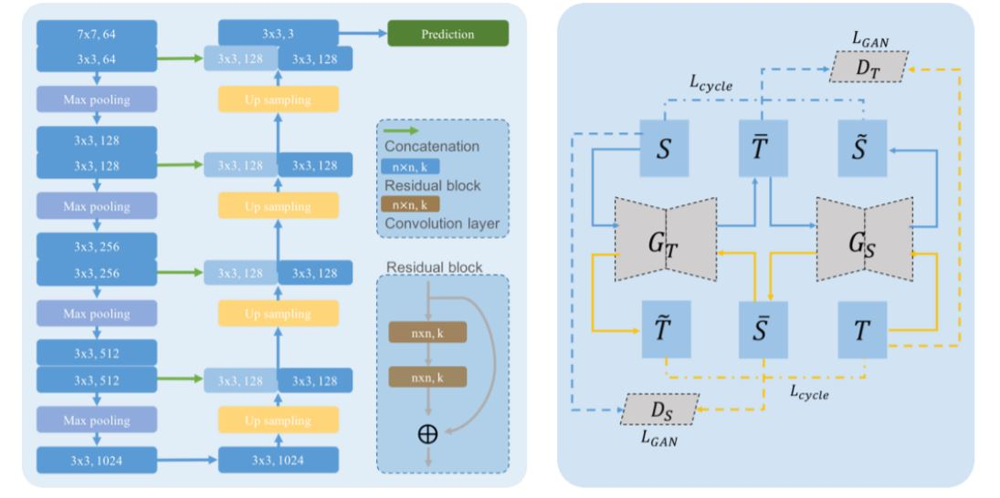
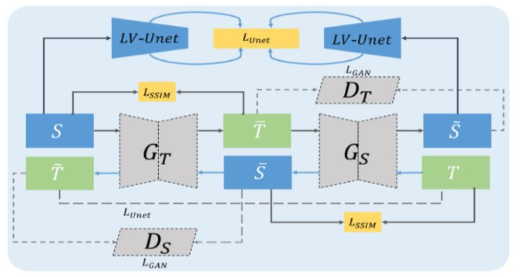

1. Firstly, the Unet is trained by data from the source domain with sufficient
annotation, and the performance in the test set from the same source domain is
guaranteed to be up to the state-of-the-art.
2. The generators �:, �; and discriminators �:,�; in Unet-GAN are trained
alternately using unannotated data from both source and target domains, using the
loss function defined in the previous section, integrating the Unet features.
3. Finally, data from the target domain are first translated to the source domain by �:,
and then fed to the trained Unet for segmentation.

## [A DOMAIN-ADAPTIVE TWO-STREAM U-NET FOR ELECTRON MICROSCOPY IMAGE
SEGMENTATION](https://ieeexplore.ieee.org/stamp/stamp.jsp?tp=&arnumber=8363602)

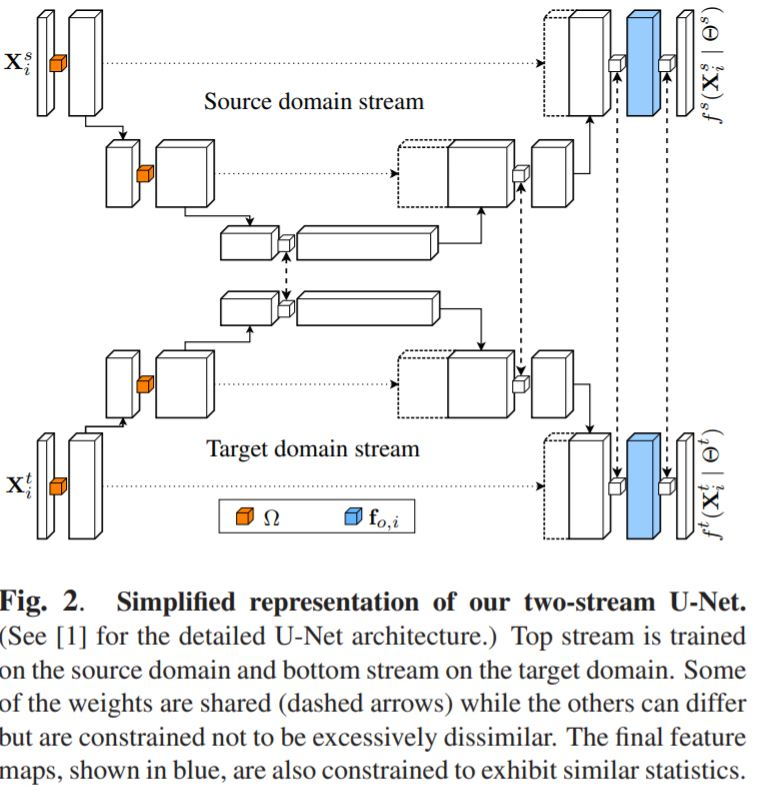
