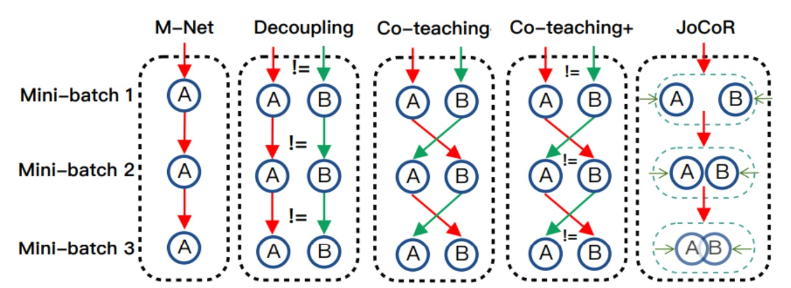
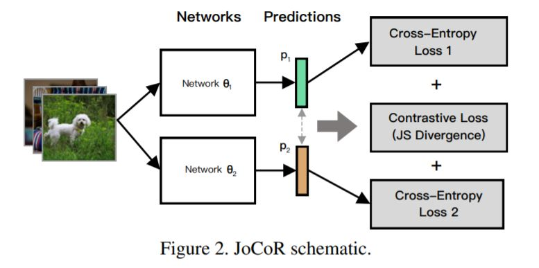
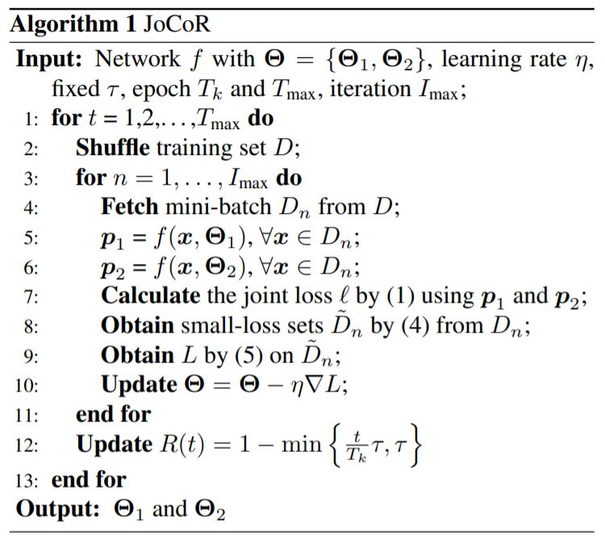

{}
Note: This page is a mixed up of different references. Networks and algorithms and some texts are taken from the references.
{}

Deep Learning with noisy labels is a practically challenging problem in weakly supervised learning.

* Annotation companies choose some alternating methods such as crowdsourcing [39, 43] and online queries [3] to
improve labelling efficiency. Unfortunately, these methods
usually suffer from unavoidable noisy labels, which have
been proven to lead to noticeable decrease in performance
of DNNs [1, 44].

* estimate the latent noisy transition matrix [21, 24, 32].  

* training on selected or weighted samples, e.g., Mentornet [16], gradient-based reweight [ref](https://arxiv.org/pdf/1803.09050.pdf) and Co-teaching [12]. 

* Small-loss selection

The state-of-the-art approaches are:

* Decoupling
* [Co-teaching](https://arxiv.org/pdf/1804.06872.pdf)
* [Co-teaching+](https://arxiv.org/pdf/1901.04215.pdf)

* [JoCoR (Joint Training with Co-Regularization)](https://arxiv.org/pdf/2003.02752.pdf)

Other deep learning methods. In addition to the aforementioned approaches, there are some other deep learning solutions [13, 17] to deal with noisy labels, including pseudo-label based [35, 40] and robust loss based approaches [28, 46]. For pseudo-label based approaches, Joint
optimization [35] learns network parameters and infers the
ground-true labels simultaneously. PENCIL [40] adopts label probability distributions to supervise network learning
and to update these distributions through back-propagation
end-to-end in each epoch. For robust loss based approaches,
F-correct[28] proposes a robust risk minimization method
to learn neural networks for multi-class classification by estimating label corruption probabilities. GCE [46] combines
the advantages of the mean absolute loss and the cross entropy loss to obtain a better loss function and presents a theoretical analysis of the proposed loss functions in the context of noisy labels.

## JoCoR

* Paper:

  *  Title: Combating Noisy Labels by Agreement: A Joint Training Method with Co-Regularization
  *  Datasets: MNIST, CIFAR-10, CIFAR-100 and Clothing1M
  *  Main idea: To encourage two different classifiers
      to make predictions closer to each other by explicit regularization.
  *  Network
  
  
  *  Equations

    

    

    

it aims to reduce the diversity of two networks during training. Specifically, it uses two networks to make predictions on
the same mini-batch data and calculate a joint loss with
Co-Regularization for each training example.

    * Algorithm
    
    

## [CleanLab](https://github.com/cgnorthcutt/cleanlab)

Where can your user find your project code? How can they install it (binaries, installable package, build from source)? Are there multiple options/versions they can install and how should they choose the right one for them?

## [inpainting](https://arxiv.org/pdf/1910.11908.pdf)
[2](https://arxiv.org/pdf/1611.09969.pdf)

